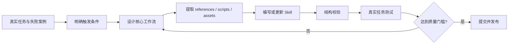

<div align="center">

# Codex Skills Collection

**一套面向真实工作流、可安装、可验证、可持续迭代的 Codex Skills。**

这个仓库不再只服务于 PPT 生成。它将用于收集和维护不同领域的 Codex Skills，把可复用的专业知识、工作流程、工具约束和质量门槛沉淀成能够直接安装的能力包。

[Skill 目录](#skill-目录) · [设计原则](#设计原则) · [快速开始](#快速开始) · [质量标准](#skill-质量标准) · [常见问题](#常见问题)

[](#skill-目录)
[](#设计原则)
[](#skill-质量标准)
[](https://github.com/xw9114/ppt-design-pro/stargazers)
[](https://github.com/xw9114/ppt-design-pro/issues)
[](https://github.com/xw9114/ppt-design-pro/commits/main)

</div>

## 为什么建立这个仓库？

通用模型能够完成很多任务，但真正稳定的专业交付往往依赖明确的流程、领域知识、工具契约和验证标准。Skill 的价值，是把这些经验变成可以重复调用的工程资产。

| 需求 | 这个仓库提供什么 |
|---|---|
| 专业任务不能只靠临时提示词 | 把稳定流程固化到 `SKILL.md`，减少每次重新解释 |
| 不同任务需要不同工具和边界 | 为每个 Skill 定义触发条件、允许工具、输入输出和禁止事项 |
| 长说明会占用大量上下文 | 使用渐进披露，把详细规则放入 `references/`，按需读取 |
| 生成结果缺少质量保证 | 为复杂交付增加渲染、测试、检查表和可追溯记录 |
| 优秀经验难以复用和传播 | 通过 Git 版本管理，让 Skill 可以安装、更新、评审和改进 |

## Skill 目录

### 已收录

| Skill | 状态 | 解决的问题 | 入口 |
|---|---|---|---|
| `ppt-design-pro` | 可用 | 提升 PPT 的叙事、视觉、模板复用、可编辑性与 QA 质量 | [`SKILL.md`](./SKILL.md) |

### 计划扩展

未来可以继续收录以下类型的 Skill：

- 文档、表格、PDF 和演示文稿工作流
- 软件开发、测试、代码审查和发布流程
- 数据分析、可视化和数学建模
- 研究、资料整理和证据核验
- 特定行业、团队或项目的专业规范

> 当前仓库从 `ppt-design-pro` 演进而来。为保持现有安装方式兼容，首个 Skill 暂时保留在仓库根目录；新增 Skill 建议逐步采用 `skills/<skill-name>/` 目录结构。

## 设计原则

| 原则 | 要求 |
|---|---|
| 解决真实问题 | Skill 必须对应明确、重复出现的工作任务，而不是抽象口号 |
| 保持简洁 | 只写模型无法可靠自行推断的知识，避免把 Skill 写成百科全书 |
| 渐进披露 | 核心流程放在 `SKILL.md`，详细规范放入一层 `references/` |
| 工具契约明确 | 明确使用什么工具、禁止什么路径、最终产物如何生成 |
| 证据优先 | 不把未经验证的推测当事实；数据、引用和素材必须可追溯 |
| 交付可验证 | 根据风险运行测试、渲染检查、结构验证或结果复核 |
| 可持续迭代 | 用真实任务发现问题，通过 Git 提交持续改进 Skill |

## 推荐仓库结构

随着 Skill 数量增加，仓库将逐步演进为：

```text
.
|-- README.md
|-- skills/
|   |-- skill-a/
|   |   |-- SKILL.md
|   |   |-- agents/
|   |   |-- references/
|   |   |-- scripts/
|   |   `-- assets/
|   `-- skill-b/
|       `-- ...
`-- shared/
    `-- reusable-guidelines/
```

每个 Skill 只创建实际需要的目录：

- `SKILL.md`：名称、触发说明和核心工作流，必需。
- `agents/openai.yaml`：Skill 列表与调用界面的元数据。
- `references/`：按需加载的领域规范、清单和参考资料。
- `scripts/`：需要稳定复用、适合确定性执行的工具脚本。
- `assets/`：模板、字体、图片或最终产物需要使用的资源。

## 快速开始

### 安装当前的 `ppt-design-pro`

PowerShell：

```powershell
git clone "https://github.com/xw9114/ppt-design-pro.git" "$HOME/.codex/skills/ppt-design-pro"
```

更新已有安装：

```powershell
git -C "$HOME/.codex/skills/ppt-design-pro" pull
```

安装或更新后，新开一个 Codex 线程，让 Skills 被重新扫描。

### 调用 Skill

```text
使用 $ppt-design-pro，帮我制作一份关于“AI 怎么助力数学建模”的学习汇报 PPT。

要求：
- 受众：学生
- 页数：12 页
- 风格：简洁、专业、数据驱动
- 输出：可编辑 PPTX
```

安装到 `$HOME/.codex/skills/` 的 Skill 属于当前用户，可在不同项目中调用；项目级 `AGENTS.md` 和更高优先级规则仍可能影响具体行为。

## Skill 质量标准

一个可以进入本仓库的 Skill，至少应满足以下要求：

| 检查项 | 验收标准 |
|---|---|
| 触发描述 | `description` 同时说明“做什么”和“何时使用” |
| 命名 | 使用小写字母、数字和连字符，目录名与 Skill 名一致 |
| 核心流程 | 步骤明确、职责清楚，不依赖隐藏上下文 |
| 资源组织 | 只创建实际需要的 `references/`、`scripts/` 或 `assets/` |
| 安全边界 | 不包含密钥、私有数据、生产凭据和未授权资产 |
| 验证 | 使用 `quick_validate.py` 检查 Skill 结构；复杂 Skill 还要经过真实任务测试 |
| 输出 | 明确最终交付物、验证证据和剩余限制 |
| 文档 | README 能说明安装、调用、目录和维护方式 |

推荐验证命令：

```powershell
python "$HOME/.codex/skills/.system/skill-creator/scripts/quick_validate.py" "<skill-directory>"
```

## Skill 开发流程



开发时优先遵循：

1. 从真实使用示例出发，而不是先设计复杂框架。
2. 让 Skill 只承担一个清晰领域或工作流。
3. 重复且易错的步骤才沉淀为脚本。
4. 详细知识进入 `references/`，核心 `SKILL.md` 保持精炼。
5. 用真实产物、日志、截图、测试和验证器证明它确实有效。

## 当前 Skill：ppt-design-pro

`ppt-design-pro` 是仓库中的第一个 Skill，也是当前可直接安装的能力包。

它在 `presentations:Presentations` 之上增加：

- action-title 故事线和 ghost-deck test
- 页型规划与视觉系统
- 模板复用和原生可编辑对象
- 来源记录和素材边界
- 全量渲染、视觉 QA 与返修
- PPTX 及可复现中间文件包

| 资源 | 文件 |
|---|---|
| Skill 主流程 | [`SKILL.md`](./SKILL.md) |
| 页型与布局规则 | [`references/slide-playbook.md`](./references/slide-playbook.md) |
| 风格配方 | [`references/style-recipes.md`](./references/style-recipes.md) |
| QA 检查表 | [`references/qa-checklist.md`](./references/qa-checklist.md) |
| 界面元数据 | [`agents/openai.yaml`](./agents/openai.yaml) |

## 贡献一个新 Skill

提交新 Skill 前，请确认：

1. 它解决的是可重复出现的具体问题。
2. `SKILL.md` 的描述能够准确触发，不会误伤无关任务。
3. 参考资料和脚本没有与主文件重复堆砌。
4. 所有脚本都已实际运行验证。
5. 不包含密钥、个人隐私、未授权素材或机器专属路径。
6. 已通过 Skill 结构校验，并记录真实任务中的验证结果。

问题、改进建议和新 Skill 提案可通过 [GitHub Issues](https://github.com/xw9114/ppt-design-pro/issues) 提交。

## 常见问题

<details>
<summary><strong>这个仓库以后还只放 PPT Skill 吗？</strong></summary>

不会。`ppt-design-pro` 是第一个 Skill，仓库将逐步扩展到文档、开发、数据分析、研究和其他专业工作流。

</details>

<details>
<summary><strong>为什么仓库名称还是 ppt-design-pro？</strong></summary>

仓库由原来的单一 PPT Skill 演进而来。更名可以在目录结构和安装方式稳定后进行，避免当前链接与已有安装立即失效。

</details>

<details>
<summary><strong>全局 Skill 和项目 Skill 有什么区别？</strong></summary>

安装在 `$HOME/.codex/skills/` 下的 Skill 面向当前用户的所有项目；项目内部的 Skill 更适合只属于某个代码库、组织或产品的规范。

</details>

<details>
<summary><strong>一个 Skill 必须包含脚本和素材吗？</strong></summary>

不需要。只有当确定性脚本、参考资料或资产能够显著提升稳定性时才添加。最小可用 Skill 只需要一个高质量的 `SKILL.md`。

</details>

<details>
<summary><strong>如何保证 Skill 不只是“提示词合集”？</strong></summary>

Skill 应包含明确的工具契约、输入输出、失败处理和验证流程，并通过真实任务产物证明它可以稳定复用。

</details>

## Star History

[](https://www.star-history.com/#xw9114/ppt-design-pro&Date)

## 社区与资源

- [GitHub Issues](https://github.com/xw9114/ppt-design-pro/issues)
- [项目仓库](https://github.com/xw9114/ppt-design-pro)
- [提交记录](https://github.com/xw9114/ppt-design-pro/commits/main)

<div align="center">

**Codex Skills Collection** · Reusable workflows for real work · Maintained by [xw9114](https://github.com/xw9114)

</div>
